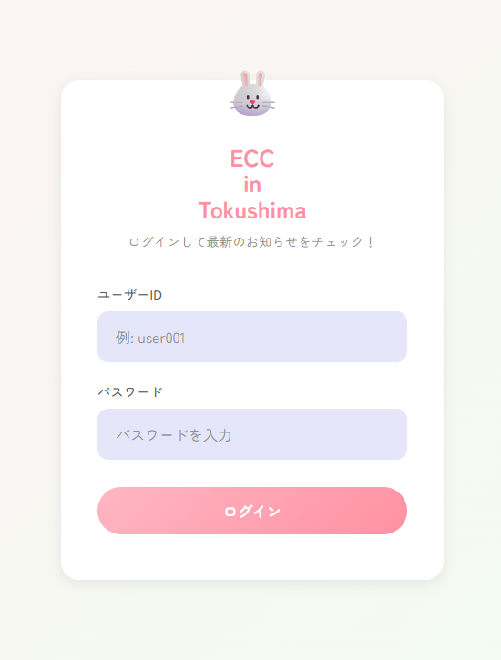
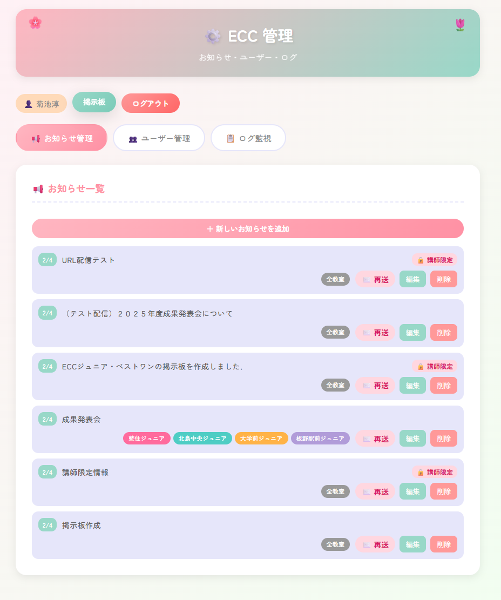
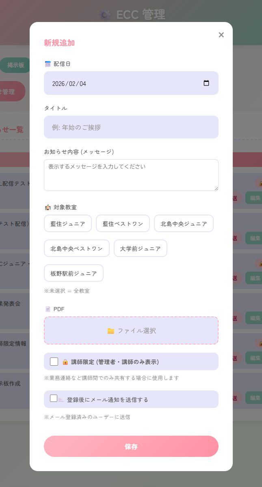
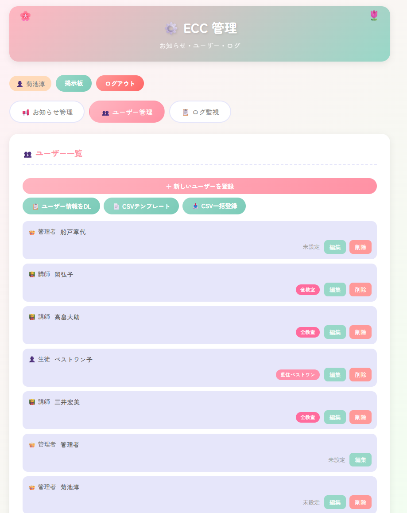
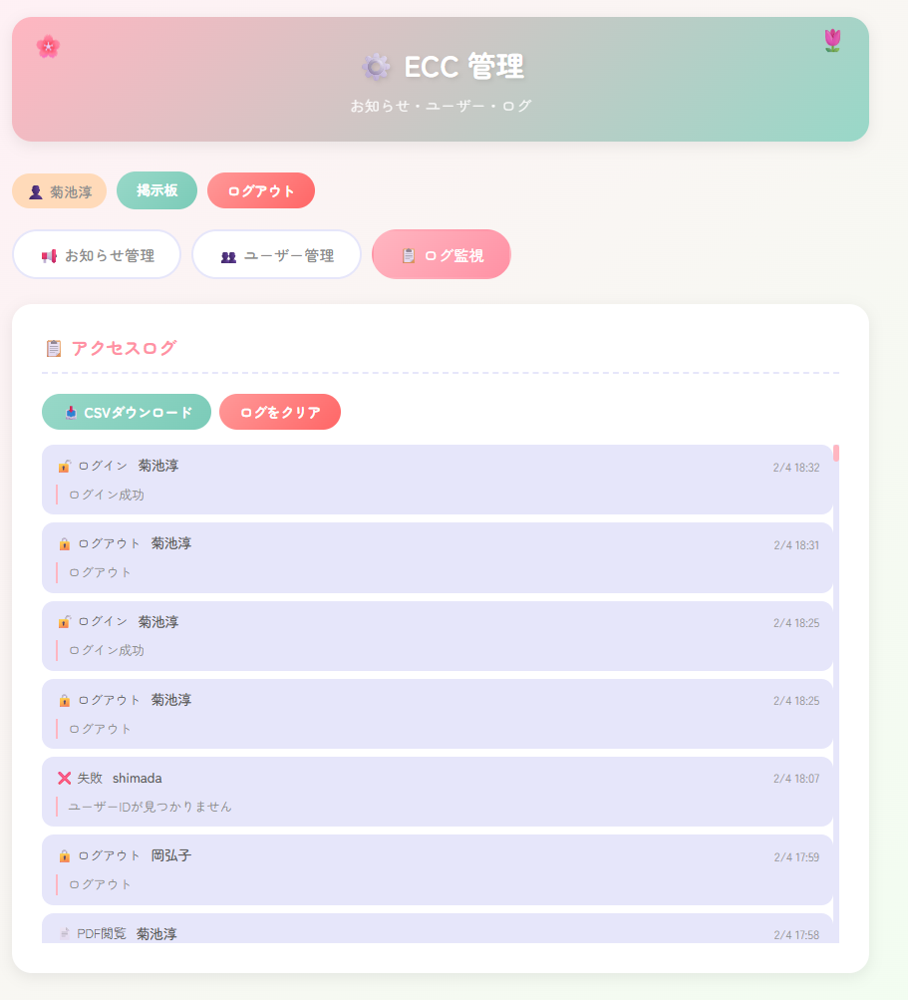
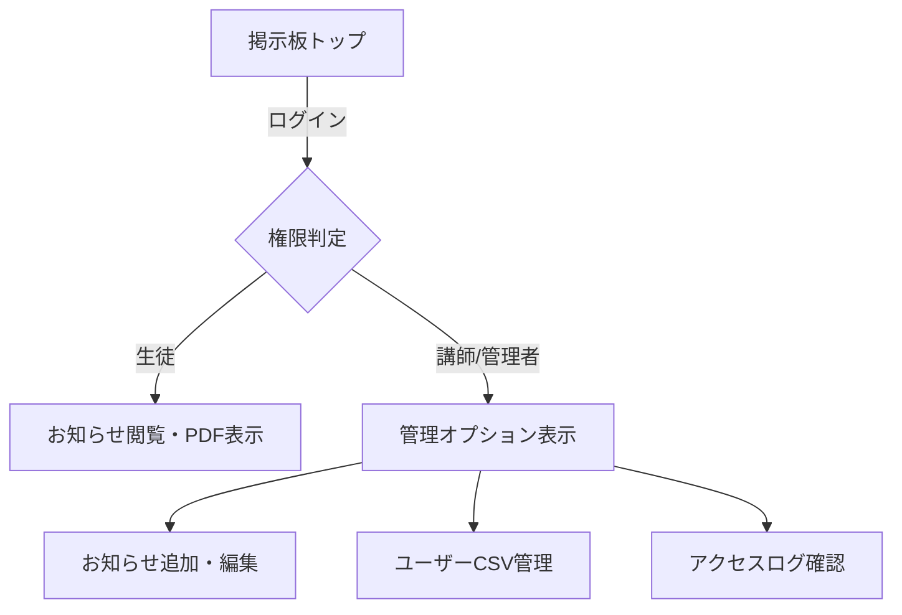

# ECC Junior 掲示板 運用マニュアル

## 1. ログイン
- **URL**: `https://ecc-junior-bulletin-board2.vercel.app/`
- **管理者ID**: `admin`
- **初期パスワード**: `adminpass`

> [!IMPORTANT]
> 管理画面へは、ログイン後にナビゲーションバーの「管理」ボタンをクリックしてアクセスします。

## 2. お知らせの管理（管理者・講師）
管理画面の「お知らせ管理」タブで操作します。

### 新規投稿
1. 「＋ 新しいお知らせを追加」ボタンをクリック。
2. **配信日**: カレンダーから選択。
3. **タイトル/内容**: 掲示板に表示される情報を入力。
   - メッセージ内にURLを貼ると、自動的にリンクになります。
4. **対象教室**: チェックを入れた教室のユーザーにのみ表示されます（未選択で全教室）。
5. **PDF添付**: 「ファイル選択」からPDFをアップロードします。
6. **講師限定**: オンにすると、生徒権限のユーザーには表示されません。
7. **メール通知**: チェックを入れると、登録時にユーザーへ一括送信されます。

### 編集・削除
- 一覧の各カードにある「編集」「削除」ボタンより操作可能です。
- 「✉️ 再送」ボタンで、過去の投稿を再度メール通知できます。

## 3. ユーザーの管理
「ユーザー管理」タブで操作します。

### 個別登録・編集
- 「＋ 新しいユーザーを登録」から1人ずつ登録可能。
- 役割（管理者・講師・生徒）と所属教室を正確に設定してください。

### CSV一括登録（推奨）
1. 「📄 CSVテンプレート」をダウンロードします。
2. Excelなどで情報を入力します。
   - **ID**: 重複不可
   - **講師/管理者(1=はい)**: `1` または `0` を入力
   - **所属教室**: `aizumi-jr` 等のIDをカンマ区切りで入力
3. 「📥 CSV一括登録」からファイルを読み込みます。

## 4. ログの確認
「ログ監視」タブにて、誰がいつPDFを閲覧したか、ログインしたか等の履歴を確認できます。不審なアクセスのチェックや、周知状況の把握に役立ててください。

## 5. 教室情報の変更
ロゴの名称やテーマカラーを変更したい場合は、システム担当者へ `schools.js` の修正を依頼してください。

---
### 画面構成イメージ

